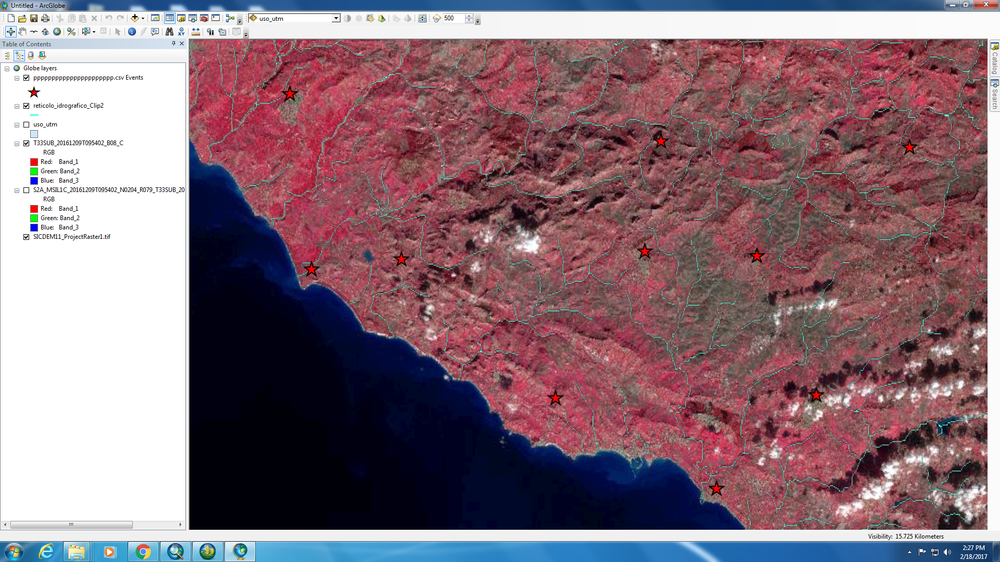
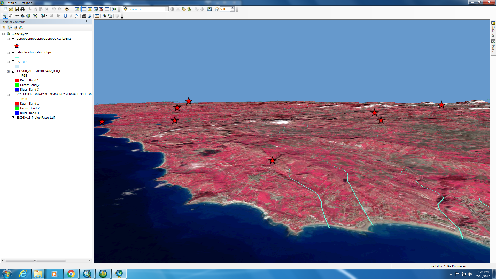
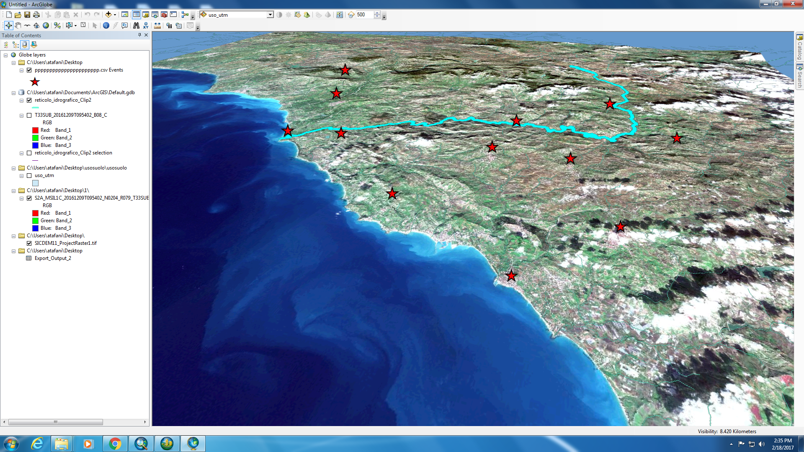
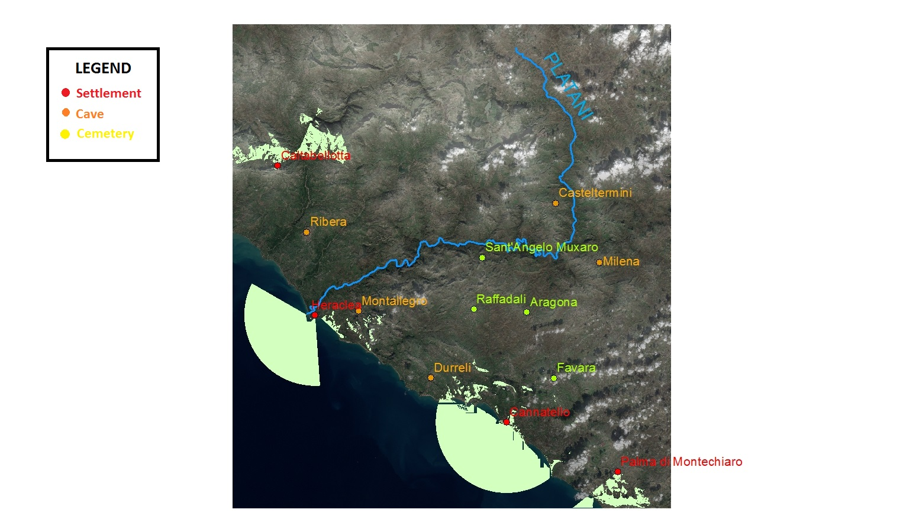
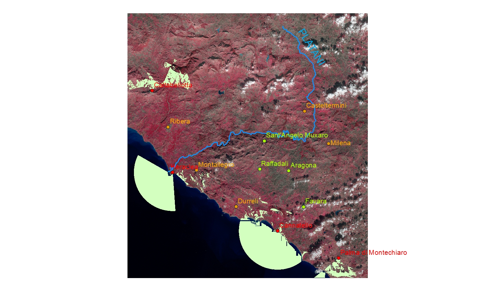

# Prehistoric occupation of the Platani River Valley (Agrigento, Sicily - Italy)
## Aurelien Tafani - Gianpiero Caso

# AIM OF THE PROJECT

The goal of this study is to show how important the Platani River Valley (Sicily, Italy) was for local prehistoric communities, and 
how it actievely shaped their choices in terms of occupation and exploitation strategies. Archaeologically, prehistoric Sicily has been poorly studied, and the literature lacks of any kind of remote sensing approaches related to past landscape uses. The information we have about this context comes from early 80s and late 90s excavation projects that have been rarely published so far. However, today's archaeology can rely on new techniques and methods to look at the occurrance of both human evidences and natural features in the landscape at the same time, such as remote sensing LiDAR. Therefore, we decided to use already-existing digital models of the landscape  to highlight the deep connection beteen ancient communities and their surrounding environment.

 

# PLATANI RIVER VALLEY
## What is it?

The Platani River Valley is a very important region in the Agrigento province, located in southern-central Sicily. This area is archaeologically crucial to understand how people occupied, moved, and exploited the local environment during the past. The valley has been occupied since a very ancient past, due to its role as a natural route running from the southern coast of Sicily to the central region, and further north. It is mainly characterized by a very harsh, rocky, dry, and warm landscape, with the presence of moderate and high elevation hills emerging from the quite-flat landscape, and generally resambling proper natural forts, which overlook the Platani river and its affluents' course.

## Why here?

The entire Platani River basin is crucial for its inhabitants, because in this part of Sicily there is an overall lack of water sources. Additionally, rivers and streams were used as highways by ancient communities, who moved, supposedly, back and forth from south to north. Therefore, we can imagine several villages located throughout the landscape that were connected with each other by these natural paths. Along with being water sources and natural pathways, rivers were exploited also as food sources (hunting and farming). Other kinds of sources people used to gather in this geographic area are salt, for storing purposes, sulphur, for its antiseptic features, calcite, for construction, and wild plants. Ultimately, the area was also used by sheperds, who led their livestock throughout the landscape seasonally.

## Who were those communities?

Evidences of human occupation are dated back to 6th-5th millennium BC (Neolithic). But it is during the Copper Age (4th millennium BC) that the human presence within this landscape became very effective. Earliest evidences of such a change in terms of landscape occupation come from cave tombs (*Tombe a Grotticella*), which were created by directly excavating the porous bedrock (mostly limestone), thus creating holes and cavities where local communities used to bury their dead. This funerary practice is the most common throughout the enire valley and even beyond it. Unfortunately we still very few information about settlements during this time period: most probably 4th millennium villages were built nearby water courses on flat low plains. Differently, evidences for later periods are more abundant and they show a fair change in terms of site selection. For instance, at the beginning of the 2nd millennium BC (Bronze Age) the number of settlement increases, along with the importance of controlling cliffs and hills overlooking main pathways. During this time period there are also evidences of communal sanctuaries and cemeteries used as social aggregation spots, in which communities from several villages gathered altogether for celebrations and rituals.

# PROJECT STEPS
## 1) Selecting digital terrain models

First of all, we had to request, and then acquire, LiDAR-generated maps from the INGV (National Institute of Geology and Vulcanology - Italy: [INGV Homepage](http://www.ingv.it/it/)). Thanks to their collaboration, we were able to download a total of 4 10-m resolution DTMs of the entire Platani River Valley ([DEM download page](http://tinitaly.pi.ingv.it/download.html))

## 2) Examining the data

We, then, decided to create two kinds of visual maps, in order to check data validity and whether or not it was possible to go through our initial reasearch questions. The results were promising because, even with a 10-m resolution, it was still possible to look at detailed features of the landscape.

Here (picture above), it is possible to look at the water streams system through the area of interest. Bright colors, from red to yellow, refer to high and moderate elevation features (hills, cliffs), whereas darker colors, from green to deep blue, refer to low elevation features and flat areas (plains and river courses).

On the other hand, this other image shows the steepness of Platani River Valley elevations in terms of color gradient: red and dark colors refer to very steep profiles, whereas lighter colors highlight less steep and flat areas.

This first examination of the data we gathered, actually enabled us to detect the main landscape features. The main river course runs through the hilly landscape, thus eroding the bedrock and, then, creating very steep slopes on both banks of its path. From the river itself, several water channels branch throughout the valley, thus filling other very low concavities usually located between high cliffs and hills. As a consequence, the visibility of the entire valley becomes an important factor for prehistoric communities, including the visibility of each site in relation to one another and the nearby river courses.

## 3) Processing the data

In order to correclty visualize the archaeological information into the digital models, we first downloaded and overlapped a satellite image to the maps we previously generated. Satellite images from Sentinel 2 satellite are free and open accessible via ESA website  ([ESA.int](http://www.esa.int/Our_Activities/Observing_the_Earth/Copernicus/Sentinel-2))

Once we completed this step, we then insert the coordinates of the archaeological sites, including remains for settlements, cave contexts, and cemeteries dated back from the 4th to the 2nd millennium BC. Such an approach is crucial in order to visualize the position of each site in relation with its surrounding landscape. Satellite image and the original terrain models have different coordinate systems. Therefore we needed change them to let them match within a single coordinate system.

The images above show the infrared map of the Platani River Valley, including the location the sites mentioned in the archaeological literature we used. Bright red areas refer to the presence of very healthy plants (forests, agricultural fields, sparse Mediterranean vegetation), whereas lighter red and grey areas refer to the presence of very poor vegetation coverage, or none at all (mostly dry areas). Detecting the overall vegetation health is a key to understand the quality of soils, which means highly fertile soils produce very healthy plants (and a brighter red on the map!), whereas less fertile soils affect the vegetation negatively (lighter red or grey on the map). The creation of such 3D models are very useful in terms of landscape analysis.

The final result shows a 3D map of the area, including also the main river course, highlighted in light blue.

# USE OF SATELLITE IMAGE AND DEM FOR LANDSCAPE ARCHAEOLOGY!

The goal of this study is to look at where archaeological information can be located on a 3D model of the landscape in order to understand ancient land uses. As we previously showed, this task is very time consuming and it deals with computers and other kind digital tools...which means errors occurr constantly! However, the results are amazing, even for non-experts like us!

Since we want to show how the landscape and prehistoric communities were part of the same cultural context, we decided to look at such an interaction through the lens of visibility.

## What is visibility?

We considered the portion of visible landscape that can be seen from each site, and then relate it to the postition of each site within the landscape. Most probably these things are in a very close connection one to another. We can think about communities settling in specific positions throughout the area in order to gain advantages over the landscape (control of sources, defense, control of routes, soil fertility).

## Site Position 

In the picture above we included all the archaeological sites with their relative labels. The white areas in the shape of cones refer to the portion of landscape that are visibile from each spot. Interestingly, the settlements are nearby the coast, facing the sea, whereas the most used caves during the same time period are just behind them, throughout the inner side of the landscape. Usually caves were related with ritual purposes (water cults and funerary practices) and were connected with the cult of ancestors. Since the rocky areas in the Platani River Valley are mainly made of limestone, prehistoric communities could rely on natural shelters and cavities resulting from watering and erosion processes. Therefore, it is even less surprising that the majority of prehistoric cemeteries were also found throughout the same portion of the landscape, where the local bedrock is very porous (like a swiss cheese!) and easily workable. 

We then tried to analyze the relation of each site location with the infrared map of the landscape (see 3) Processing the data). As the picture above shows, the main known prehistoric settlements from this area are set within the portion of the landscape with the highest presence of healthy vegetation. That's great! It might be a clue for understanding why prehistoric communities settled here (in this case on the coast) instead of somewhere else. However, it has to be stated that at this preliminary stage we were not able to use the precise site's coordinates, but only those relative to sites' closest towns. Therefore, it is very important to consider that most of our projections (visibility cones) are not directly related to the position where the archaeological site has been found.

# CONCLUSION

This study provided lots of inormation in terms of landscape archaeology in Sicily. The lack of researches, at this stage, was not a crucial problem, as well as the lack of more detailed maps with higher resolution. Therefore, we concluded that prehistoric communities from the 4th to the 2nd millennium BC use to build their villages at coastal spots, thus privileging them over inland ones, where, instead, they buried their dead and performed ritual activities. Additionally, villages seem to face the sea, thus enabling the communities to control the entrance to the upper Platani River Valley, which looks directly related with the cult of ancestors amd ritual practices. The presence of healthy vegetation in areas around coastal sites, compared with less healthy or dry areas in the upper valley, might be considered further evidences of the reason why prehistoric communities selected specific spots according to specific activities throughout the landscape they lived in. Such a study might be considered just a preliminary survey of the archaeological data we already have. In the future, we are looking forward to requesting for higher resolution maps from the same area of interest, and try to include more archaeological information that will cover a broader time period, in order to create an interactive map of prehistoric landscape in Sicily, also including soil quality, raw material sources, and other variables related to the landscape.

# ACKNOWLEDGMENTS 

We would like to thank the INGV operators that provided us the authorization for downloading the DEMs:

The content includes four papers describing to some extent the DEM database (including input data and interpolation algorithms). Do not hesistate to contact me for any problem in downloading/using data or if you need a broader area.
I recall below terms and conditions of use:
(i) data is provided for research purposes only;
(ii) data is provided solely to the person named on this application form and should not be given to third parties. Third parties who might need access to the same dataset are required to fill their own application forms.
(iii) data must be referenced with the following citations:
(iv) Our aim is to provide scientific information to members of national and international scientific communities. The Istituto Nazionale di Geofisica e Vulcanologia assumes no responsibility for the downloaded data, which is not necessarily updated. The global accuracy of the digital elevation model id described in the above reference #1. Nevertheless, we cannot exclude the presence of local higher errors.
1. Tarquini S., Isola I., Favalli M., Mazzarini F., Bisson M., Pareschi M. T., Boschi E. (2007). TINITALY/01: a new Triangular Irregular Network of Italy, Annals of Geophysics 50, 407 - 425.
2. Tarquini S., Vinci S., Favalli M., Doumaz F., Fornaciai A., Nannipieri L., (2012). Release of a 10-m-resolution DEM for the Italian territory: Comparison with global-coverage DEMs and anaglyph-mode exploration via the web, Computers & Geosciences 38, 168-170. doi: doi:10.1016/j.cageo.2011.04.018.
Thank you for your interest in our work.
Kind regards

We would also mention the ESA organization that provides free and open access to very detailed satellite images. We also would like to thank Dr. Rachel Opitz for the support provided during the data processing and the website creation steps, Dr. Davide Tanasi for the archaeological background information, and the CVAST for providing the facility and the instrument for such a study. Ultimately, we would like to thank the USF - Department of Applied Anthropology for giving us the opportunity to work on such a topic.
For any other information or specific request, please contact Mr. Aurelien Tafani (atafani@mail.usf.edu), or Mr. Gianpiero Caso (gianpiero@mail.usf.edu).

