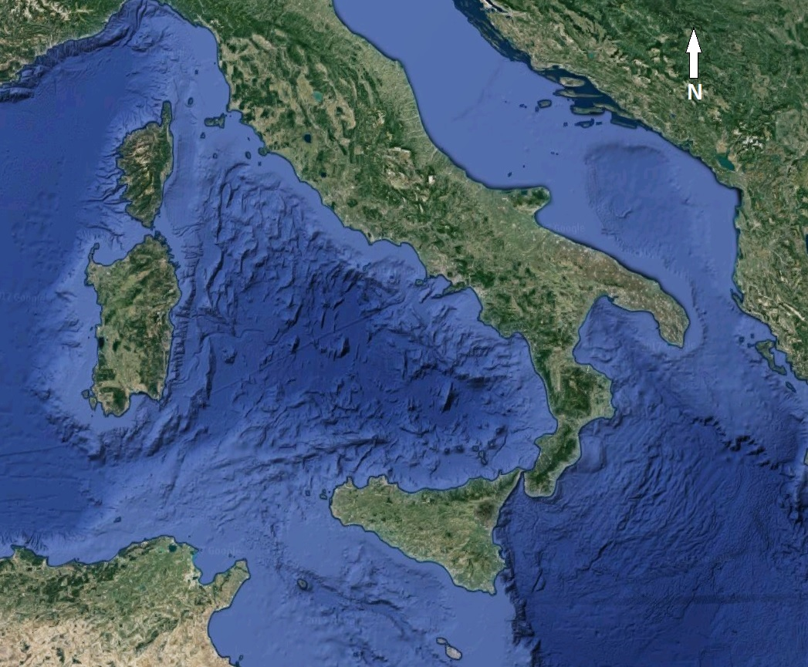
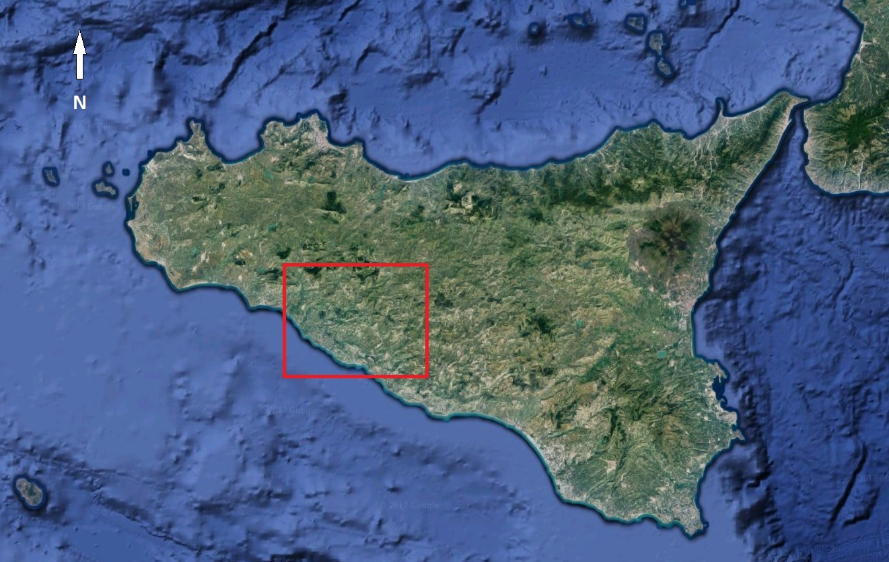
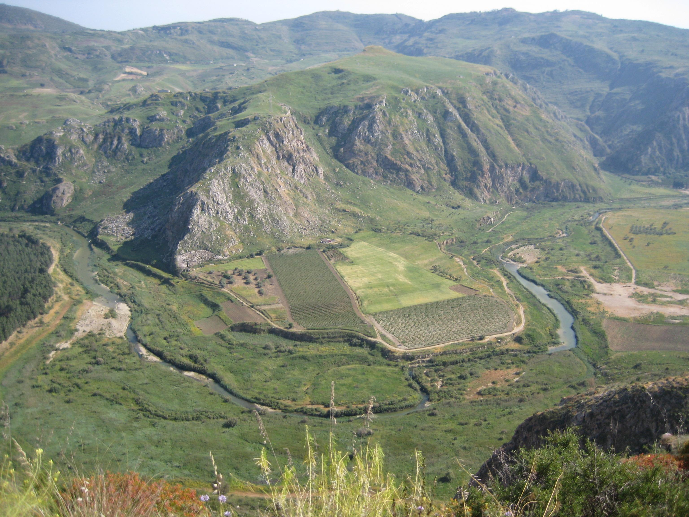
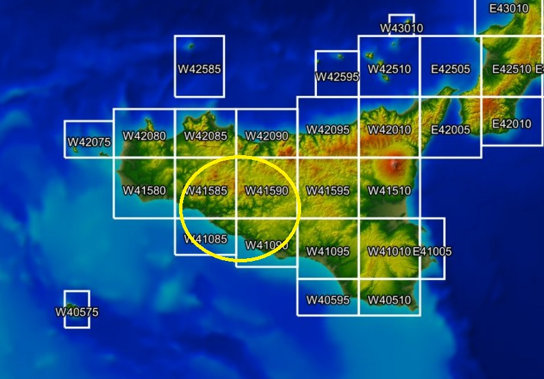
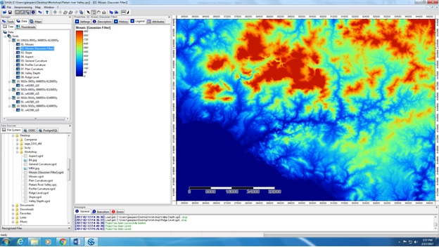
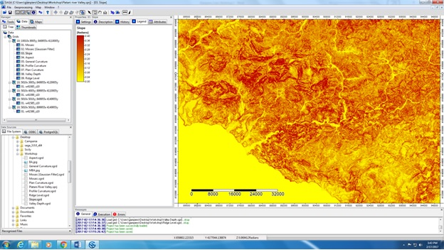
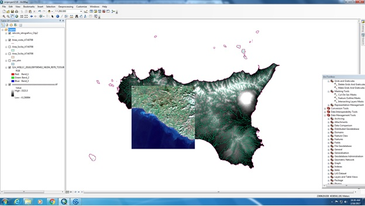
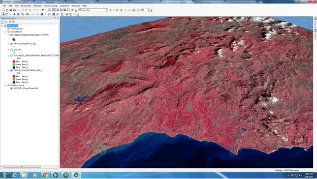

# AIM OF THE PROJECT

The goal of this study is to show how important the Platani River Valley (Sicily, Italy) was for local prehistoric communities, and 
how it actievely shaped their choices in terms of occupation and exploitation strategies. Archaeologically, prehistoric Sicily has been poorly studied, and the literature lacks of any kind of remote sensing approaches related to past landscape uses. The information we have about this context comes from early 80s and late 90s excavation projects that have been rarely published so far. However, today's archaeology can rely on new techniques and methods to look at the occurrance of both human evidences and natural features in the landscape at the same time, such as remote sensing LiDAR. Therefore, we decided to use already-existing digital models of the landscape  to highlight the deep connection beteen ancient communities and their surrounding environment.

 

# PLATANI RIVER VALLEY
## What is it?

The Platani River Valley is a very important region in the Agrigento province, located in southern-central Sicily. This area is archaeologically crucial to understand how people occupied, moved, and exploited the local environment during the past. The valley has been occupied since a very ancient past, due to its role as a natural route running from the southern coast of Sicily to the central region, and further north. It is mainly characterized by a very harsh, rocky, dry, and warm landscape, with the presence of moderate and high elevation hills emerging from the quite-flat landscape, and generally resambling proper natural forts, which overlook the Platani river and its affluents' course.

## Why here?

The entire Platani River basin is crucial for its inhabitants, because in this part of Sicily there is an overall lack of water sources. Additionally, rivers and streams were used as highways by ancient communities, who moved, supposedly, back and forth from south to north. Therefore, we can imagine several villages located throughout the landscape that were connected with each other by these natural paths. Along with being water sources and natural pathways, rivers were exploited also as food sources (hunting and farming). Other kinds of sources people used to gather in this geographic area are salt, for storing purposes, sulphur, for its antiseptic features, calcite, for construction, and wild plants. Ultimately, the area was also used by sheperds, who led their livestock throughout the landscape seasonally.

## Who were those communities?

Evidences of human occupation are dated back to 6th-5th millennium BC (Neolithic). But it is during the Copper Age (4th millennium BC) that the human presence within this landscape became very effective. Earliest evidences of such a change in terms of landscape occupation come from cave tombs (*Tombe a Grotticella*), which were created by directly excavating the porous bedrock (mostly limestone), thus creating holes and cavities where local communities used to bury their dead. This funerary practice is the most common throughout the enire valley and even beyond it. Unfortunately we still very few information about settlements during this time period: most probably 4th millennium villages were built nearby water courses on flat low plains. Differently, evidences for later periods are more abundant and they show a fair change in terms of site selection. For instance, at the beginning of the 2nd millennium BC (Bronze Age) the number of settlement increases, along with the importance of controlling cliffs and hills overlooking main pathways. During this time period there are also evidences of communal sanctuaries and cemeteries used as social aggregation spots, in which communities from several villages gathered altogether for celebrations and rituals.

# PROJECT STEPS
## 1) Selecting digital terrain models

First of all, we had to request, and then acquire, LiDAR-generated maps from the INGV (National Institute of Geology and Vulcanology - Italy: [INGV Homepage](http://www.ingv.it/it/)). Thanks to their collaboration, we were able to download a total of 4 10-m resolution DTMs of the entire Platani River Valley ([DEM download page](http://tinitaly.pi.ingv.it/download.html))

## 2) Examining the data

We, then, decided to create two kinds of visual maps, in order to check data validity and whether or not it was possible to go through our initial reasearch questions. The results were promising because, even with a 10-m resolution, it was still possible to look at detailed features of the landscape.

 

- Bulleted
- List

1. Numbered
2. List

### Jekyll Themes

Your Pages site will use the layout and styles from the Jekyll theme you have selected in your [repository settings]

The name of this theme is saved in the Jekyll `_config.yml` configuration file.

### Support or Contact

Having trouble with Pages? Check out our [documentation](https://help.github.com/categories/github-pages-basics/) or [contact support](https://github.com/contact) and we’ll help you sort it out.

